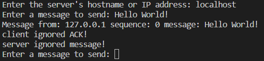

# Simple UPD Chat

This is a simple clinet to server chat using UDP

## Authors

- [@lallalamin](https://github.com/lallalamin)

## Documentation

Firstly, the program will ask you for hostname or IP
address. Once you type input, the program will run 
server thread and client thread. 

server()
- Receive message from the client
- Implement a simple protocol to send to client that it
  receive the message and print out the message, address,
  and sequence number.
- Will ignore client message sometime

client()
- Ask the user to enter the message they want to send
  to the server
- Send the message to the server and implement a simple
  protocol waiting acknowledgement from the server
- If we encounter timeout, the protocol will resend the 
  message again
- Will ignore server message sometime.

